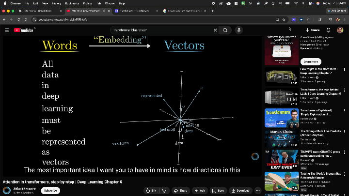

# ScrollGuard

A Manifest V3 Chrome extension that enforces a **shared daily time budget** across social media and distraction sites. Once the cumulative limit is reached, all tracked sites are hard-blocked for the rest of the day.

---

## Demo

### GIF


### YouTube
[](https://www.youtube.com/watch?v=ZbTr48dW0xI)

---

## Features

- **Cumulative budget** — time spent across all tracked sites counts toward one shared daily limit
- **Hard block** — full-page overlay when the limit is hit; no dismiss button, no snooze
- **Active-tab tracking only** — time is counted only while the tab is visible and in focus; backgrounded tabs don't count
- **Midnight reset** — budget resets automatically at midnight (system local time)
- **Configurable limit** — drag a slider to set your daily budget between 1 and 120 minutes
- **Editable site list** — preset sites included by default; add or remove any domain from the popup
- **On/off toggle** — pause tracking without losing your settings
- **Two-tap reset** — manually reset today's usage from the popup

---

## Preset Sites

Twitter/X · Instagram · TikTok · Reddit · YouTube · Facebook · LinkedIn

---

## Installation

> The extension is not on the Chrome Web Store. Load it manually in developer mode.

1. Clone or download this repository
2. Open Chrome and navigate to `chrome://extensions/`
3. Enable **Developer mode** (toggle in the top-right corner)
4. Click **Load unpacked**
5. Select the `scrollguard` folder
6. The ScrollGuard icon appears in your toolbar

---

## Usage

| Action | How |
|---|---|
| See time used / remaining | Click the toolbar icon |
| Change daily limit | Drag the slider in the popup |
| Add a site to track | Type a domain in the popup and press `+` |
| Remove a site | Click `×` next to any site in the popup list |
| Pause tracking | Toggle the switch in the popup header |
| Reset today's data | Click "Reset Today's Usage" twice in the popup |

---

## File Structure

```
scrollguard/
├── manifest.json     Extension config (Manifest V3)
├── background.js     Service worker — stores state, enforces limits
├── content.js        Injected into pages — tracks active time, shows block overlay
├── popup.html        Toolbar popup markup
├── popup.css         Popup styles
├── popup.js          Popup logic (stats display, settings)
├── icons/
│   ├── icon16.png
│   ├── icon48.png
│   └── icon128.png
└── .gitignore
```

---

## How It Works

### Time tracking
`content.js` is injected into every page. On load it asks `background.js` whether the current site is tracked. If it is, a ticker fires every **5 seconds** via `setInterval` — but only while `document.visibilityState === 'visible'`. Each tick sends a `TICK` message to the background with `seconds: 5`.

### Limit enforcement
`background.js` accumulates `totalSeconds` in `chrome.storage.local`. On every tick it checks whether `totalSeconds >= dailyLimit * 60`. If so, it sets `blocked: true`, persists it, and returns `{ blocked: true }` to the content script.

### Block overlay
When the content script receives `blocked: true` it injects a full-screen `position: fixed` overlay with `z-index: 2147483647` (the maximum). All pointer events on the page beneath are disabled. The overlay cannot be dismissed.

### Daily reset
`getSession()` in `background.js` compares `session.date` to the current date string on every call. If they differ (i.e. it's a new day), the session is wiped and restarted automatically.

### Storage schema

```js
// chrome.storage.local keys:

config: {
  dailyLimit: 10,          // minutes (1–120)
  enabled: true,
  presetSites: [...],
  customSites: [...]
}

session: {
  date: "Mon Apr 07 2026", // compared against new Date().toDateString()
  totalSeconds: 0,
  blocked: false
}
```

---

## Permissions

| Permission | Why |
|---|---|
| `storage` | Save config and session data locally |
| `host_permissions: <all_urls>` | Inject `content.js` into tracked sites |

No data is sent to any server. Everything is stored locally in `chrome.storage.local`.

---

## Limitations

- Time tracking is based on tab visibility, not scroll activity — if you leave a tracked tab open and visible, it counts even if you're not scrolling
- Blocking is per-browser-session; clearing extension data or reinstalling resets all state
- The extension does not sync across devices (`chrome.storage.local`, not `sync`)
